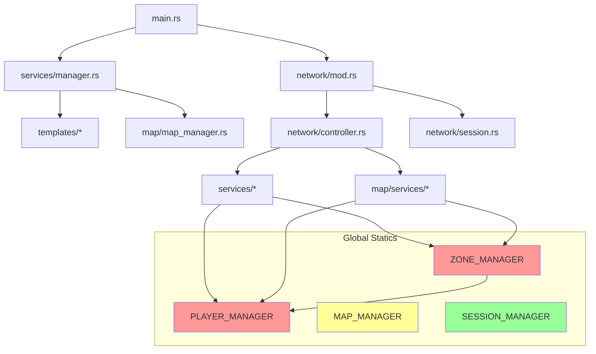

# Deep Architecture Analysis

## Tổng quan hệ thống

```
┌─────────────────────────────────────────────────────────────────────────────────────────┐
│                                     GAME SERVER                                         │
│                                                                                         │
│  ┌─────────────────────────────────────────────────────────────────────────────────┐   │
│  │                            GLOBAL STATICS (Singletons)                           │   │
│  │                                                                                  │   │
│  │  ┌───────────────┐  ┌───────────────┐  ┌───────────────┐  ┌──────────────────┐  │   │
│  │  │PLAYER_MANAGER │  │ ZONE_MANAGER  │  │SESSION_MANAGER│  │   MAP_MANAGER    │  │   │
│  │  │  (DashMap)    │  │ (RwLock<Map>) │  │    (DashMap)  │  │ (RwLock<HashMap>)│  │   │
│  │  └───────────────┘  └───────────────┘  └───────────────┘  └──────────────────┘  │   │
│  └─────────────────────────────────────────────────────────────────────────────────┘   │
│                                           │                                             │
│  ┌────────────────────────────────────────┼────────────────────────────────────────┐   │
│  │                              DATA FLOW  │                                        │   │
│  │                                         ▼                                        │   │
│  │  ┌─────────┐    ┌───────────┐    ┌───────────┐    ┌───────────┐               │   │
│  │  │ Network │───►│Controller │───►│ Services  │───►│   Zone    │               │   │
│  │  │ (TCP)   │    │(async)    │    │(sync)     │    │(update)   │               │   │
│  │  └─────────┘    └───────────┘    └───────────┘    └───────────┘               │   │
│  └─────────────────────────────────────────────────────────────────────────────────┘   │
└─────────────────────────────────────────────────────────────────────────────────────────┘
```

---

## Chi tiết các Module

### 1. Network Layer

```
network/
├── mod.rs              # TCP server, connection handling
├── session.rs          # Session state, reader/writer với encryption
├── controller.rs       # Message routing (777 lines, 17 handlers)
├── message.rs          # Binary message protocol
└── session_manager.rs  # Active session tracking
```

**Flow:**
```
TcpListener.accept()
    │
    ▼
handle_connection()
    │
    ├── AsyncSession::new()
    │
    ├── spawn_write_task() ←─── mpsc::channel
    │
    └── run_read_loop()
            │
            ▼
        Controller::process()
```

**Vấn đề tiềm ẩn:**
- Controller là async nhưng gọi sync services
- Session chứa `Arc<RwLock<SessionState>>` và `Arc<Mutex<SessionReader/Writer>>`

---

### 2. Player Module

```
player/
├── player.rs           # Main Player struct (415 lines, 39 methods)
├── player_manager.rs   # DashMap<u64, Player>
├── player_mapper.rs    # DB to runtime mapping
├── player_parser.rs    # JSON parsing
├── player_data.rs      # Player data structures
└── components/
    ├── n_point.rs      # HP, MP, stats (10KB)
    ├── player_skill.rs # Skills
    ├── player_intrinsic.rs
    ├── player_friend.rs
    └── player_item_time.rs
```

**Player struct:**
```rust
pub struct Player {
    pub id: u64,
    pub name: String,
    pub gender: u8,
    pub map_id: i32,
    pub zone_id: i32,
    pub location: Location,
    pub n_point: NPoint,           // HP, MP, stats
    pub player_skill: PlayerSkill, // Skills
    pub inventory: Inventory,      // Items
    pub effect_skill: EffectSkill, // Effects
    pub session: Arc<RwLock<Option<SessionArc>>>,
    // ... 30+ more fields
}
```

**PLAYER_MANAGER method nguy hiểm:**
```rust
pub fn get_mut(&self, id: u64) -> Option<RefMut<'_, u64, Player>>
// Trả về guard giữ lock cho đến khi drop
```

---

### 3. Map Module

```
map/
├── models/
│   ├── zone.rs       # Zone (players, mobs, items)
│   ├── map.rs        # Map template + zones
│   ├── waypoint.rs   # Teleport points
│   └── item_map.rs   # Items on ground
├── managers/
│   ├── zone_manager.rs   # ZONE_MANAGER global
│   ├── map_manager.rs    # MAP_MANAGER global
│   └── tile_loader.rs
├── services/
│   ├── mob_service.rs    # Mob AI, combat
│   ├── map_service.rs
│   ├── item_map_service.rs
│   └── change_map_service.rs
└── dao/
    └── map_dao.rs
```

**Zone struct:**
```rust
pub struct Zone {
    pub map_id: i32,
    pub zone_id: i32,
    pub max_player: i32,
    pub player_ids: Arc<DashSet<u64>>,        // Chỉ lưu IDs!
    pub active_mobs: Arc<RwLock<Vec<RtMob>>>,
    pub active_items: Arc<RwLock<Vec<ItemMap>>>,
}
```

**Vấn đề Zone:**
- Zone lưu `player_ids` nhưng access player qua `PLAYER_MANAGER.get()`
- Mỗi lần access = lock acquisition
- `send_message_to_all_players()` iterate và get từng player

---

### 4. Services Module

```
services/
├── services.rs           # ServiceHandles (network send functions)
├── skill_service.rs      # Skill execution (449 lines)
├── effect_skill_service.rs # Effects (421 lines)
├── player_service.rs     # Player update loop (195 lines)
├── player_info_service.rs
├── manager.rs            # Init và game loop
├── command.rs            # Chat commands
├── auth_service.rs
└── intrinsic_service.rs
```

**Mixed Concerns trong services:**
```rust
// ❌ Hiện tại: Gọi send trong khi có thể đang giữ lock
pub fn set_is_monkey(player: &mut Player) {
    player.effect_skill.is_monkey = true;
    send_effect_monkey(player);      // <-- Network I/O
    send_cai_trang(player);          // <-- Network I/O
}
```

---

## Lock Hierarchy Analysis

### Global Managers và Lock Types

| Manager | Lock Type | Usage Count | Potential Conflicts |
|---------|-----------|-------------|---------------------|
| `PLAYER_MANAGER` | DashMap (per-key lock) | 28 locations | Zone iterations |
| `ZONE_MANAGER` | RwLock<HashMap> | 15 locations | Map updates |
| `MAP_MANAGER` | RwLock<HashMap> | 8 locations | Game loop |
| `SESSION_MANAGER` | DashMap | 5 locations | Disconnect |

### Nested Lock Patterns (Nguy hiểm!)

```
Pattern 1: player_service → Zone → PLAYER_MANAGER
──────────────────────────────────────────────────
PLAYER_MANAGER.get_mut(id)  ← Lock 1 acquired
    │
    └─► service function
            │
            └─► send_to_zone()
                    │
                    └─► zone.send_message_to_all_players()
                            │
                            └─► PLAYER_MANAGER.get(other_id)  ← Lock 2!
                                        │
                                        ▼
                                    POTENTIAL DEADLOCK
```

```
Pattern 2: Controller → Zone → PLAYER_MANAGER
─────────────────────────────────────────────
Controller::process(session, msg)
    │
    └─► session.get_player() → get player_id only
            │
            └─► ZONE_MANAGER.get_zone() ← Lock 1
                    │
                    └─► zone.get_all_players()
                            │
                            └─► PLAYER_MANAGER.get(id) ← Lock 2
```

---

## Game Loop Analysis

```
┌─────────────────────────────────────────────────────────────┐
│                   GAME LOOP (1000ms interval)               │
│                                                             │
│  start_map_update_task()                                    │
│       │                                                     │
│       ▼                                                     │
│  MAP_MANAGER.update_game_loop()                             │
│       │                                                     │
│       └─── for zone in all_zones {                          │
│                zone.update()                                │
│            }                                                │
│                │                                            │
│                ├─► mob_service::update(&zone)               │
│                │       └─► get PLAYER_MANAGER.get_mut()     │
│                │       └─► broadcast messages               │
│                │                                            │
│                ├─► player_service::update(&zone)            │
│                │       └─► PLAYER_MANAGER.get_mut()         │
│                │       └─► effect updates (bienkhi, etc)    │
│                │       └─► send messages ← DEADLOCK POINT   │
│                │                                            │
│                └─► item cleanup                             │
└─────────────────────────────────────────────────────────────┘
```

---

## Data Flow Tracing

### Use Skill Flow

```
Client sends USE_SKILL (-45)
    │
    ▼
Controller::process()
    │
    └─► session.get_player_mut()
            │
            └─► PLAYER_MANAGER.get_mut(player_id)  ← Lock 1
                    │
                    └─► skill_service::handle_use_skill_packet()
                            │
                            ├─► Update player state
                            │
                            └─► send_effect_use_skill()
                                    │
                                    └─► zone.send_message_to_all_players()
                                            │
                                            └─► for id in player_ids {
                                                    PLAYER_MANAGER.get(id) ← Lock 2!
                                                }
```

### Join Map Flow

```
Client login success
    │
    ▼
initialize_logged_in_session()
    │
    └─► ZONE_MANAGER.load_player_to_best_zone()
            │
            └─► zone.load_player_to_zone(player)
                    │
                    ├─► zone.add_player(player)
                    │       └─► PLAYER_MANAGER.add(player)
                    │
                    ├─► zone.load_another_to_me()
                    │       └─► PLAYER_MANAGER.get() for each player
                    │
                    ├─► zone.load_me_to_another()
                    │       └─► PLAYER_MANAGER.get() × N
                    │
                    └─► zone.map_info()
```

---

## Dependencies Graph



---

## Phát hiện vấn đề cụ thể

### 1. Clone Player nhiều lần

```rust
// PlayerManager::get() clone toàn bộ Player
pub fn get(&self, id: u64) -> Option<Player> {
    self.players.get(&id).map(|p| p.clone())  // Clone 30+ fields!
}
```

**Vấn đề**: Player có 30+ fields, clone tốn memory và CPU.

### 2. Zone không sync với PLAYER_MANAGER

```rust
// Zone lưu IDs
pub player_ids: Arc<DashSet<u64>>

// Nhưng data ở PLAYER_MANAGER
pub fn get_player(&self, player_id: u64) -> Option<Player> {
    if self.player_ids.contains(&player_id) {
        PLAYER_MANAGER.get(player_id)  // Có thể đã bị remove!
    } else {
        None
    }
}
```

**Vấn đề**: Race condition nếu player bị remove từ PLAYER_MANAGER nhưng ID còn trong zone.

### 3. Mixed sync/async

```rust
// Controller là async
pub async fn process(session: SessionArc, msg: Message) -> Result<()>

// Nhưng gọi sync services
skill_service::handle_use_skill_packet(&mut player, ...);  // Sync!
```

**Vấn đề**: Blocking sync code trong async context.

### 4. Send trong khi hold lock

```rust
// mob_service::update()
if let Some(mut p_entry) = PLAYER_MANAGER.get_mut(pid) {
    // Giữ lock ở đây
    p_entry.injured(...);
    // Vẫn giữ lock...
}
// Lock release sau khi ra khỏi scope
```

---

## Recommendations Summary

| Issue | Severity | Recommended Fix |
|-------|----------|-----------------|
| Nested locks | 🔴 Critical | Two-Phase Pattern |
| Clone Player overhead | 🟡 Medium | Use references where possible |
| Zone/Manager sync | 🟡 Medium | Single source of truth |
| Mixed async/sync | 🟡 Medium | Make services async or use spawn_blocking |
| 30+ fields Player | 🟢 Low | Component extraction |

---

## Next Steps

1. **Immediate**: Apply Two-Phase pattern to ALL services
2. **Short-term**: Audit và document all lock acquisition paths
3. **Medium-term**: Migrate to Event-Driven architecture
4. **Long-term**: Consider Actor model nếu scale requirements tăng
